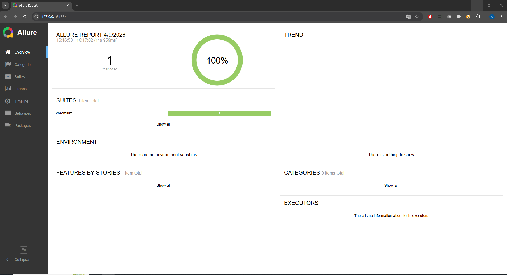

# Автотесты для Третьяковской галереи

Тестирование поиска на сайте Третьяковской галереи с использованием Playwright + JavaScript.

## Скриншот Allure отчета



## Установка и запуск

```bash
npm install
npx playwright install
npm test

## + Добавил сюда CI/CD - Настройку GitHub Actions
- ручной запуск автотестов
- автоматический по расписанию в полночь
- публикация allure с историей на GitHub Pages
